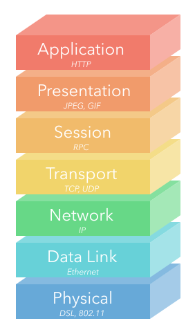

## OSI Model
- Open Systems Interconnection reference model
- Conceptual model, limited practical use
- Good for understanding networking concepts

## Layers of the OSI Model
  ### 7. Application
  - Example: HTTP
  - Information used by client-side software
  - Data will interact directly with applications and can be displayed to the user with limited translation

  ### 6. Presentation
  - Example: JPEG, GIF
  - Data gets translated into a presentable format
  - Often called the syntax layer since it translates machine-readable syntax into human-readable syntax
  - Data compression, encryption, character encoding, image formats are examples

  ### 5. Session
  - Example: RPC (Remote Procedure Call)
  - Authentication and data continuity
  - Authorize actions, reestablish dropped connections

  ### 4. Transport
  - Example: TCP, UDP
  - Mirrors TCP/IP's Transport Layer
  - Focused on data integrity and connectivity

  ### 3. Network
  - Example: IP
  - Mirrors TCP/IP's Internet Layer
  - Manages connections between different remote networks
  - Transfers packets across intermediary devices

  ### 2. Data Link
  - Example: Ethernet
  - Connections between one network interface to another
  - Primarily used by machines in a local network (ie targeting different MAC addresses)

  ### 1. Physical
  - DSL, 802.11 (Wi-Fi)
  - Translating from electrical signals to bits of data

## Main Takeaways
1. Be able to recognize a diagram as the OSI model, as opposed to the TCP/IP model
2. Give a brief description of each layer (see short examples above)
