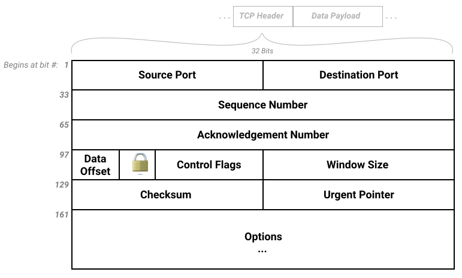
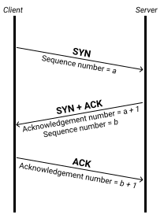

## TCP Segments
  - Application data is broken down into transmittable units
  - Each unit has a header attached to it with fields that we can compare in order to make sure that we are receiving all of the intended data.

## Segment Header Fields

  - Source Port: The port that the request originated from
  - Destination Port: The port that the request is intended for (determines which socket to use). Our most recognizable example may be when we think about localhost. If we set up a server on port 3000, the packets being sent need a destination port of 3000 for our server to receive them.
  - Sequence Number: Extablishes ordering of data. A starting number is created (Initial Sequence Number, or ISN), then each subsequent segment's number is incremented based on the size of the previous segment.
  - Acknowledgement Number: The number that corresponds to the sequence number we are responding to. The acknowledgement number is the sequence number that we received plus the length of the data that was transferred, plus 1. This allows us to determine if we've received all of the data. If there is a discrepency in numbers, we have to retransmit data.
  - Data Offset: The length of the segment header, allowing us to determine where our options field ends (or if an options field even exists)
  - Reserved: 3 bits that are always 0. Available for future flags.
  - Control Flags: 9 (currently) bits that are used for congestion monitoring and to indicate the connection lifecycle 
  - Window Size: Indicates how much data should be sent, allowing for throttling if a receiver is getting overloaded.
  - Checksum: Error-checking mechanism for an individual segment
  - Urgent Pointer: Marks data as urgent, which will be processed right away. Commonly used to terminate a transfer instead of having to wait until it finishes.
  - Options: Similar to packets' options fields, extra headers that indicate other extra details about the segment.

## Control Flags - The TCP Connection Lifecycle
  - 12 bits in our segment header
  - First 3 are reserved, not in use yet
  - Next 3 are used for network congestion monitoring/management
  - The last 6 are used to indicate the connection lifecycle of our segments:
    - URG: Urgent. Urgent data is present that should be processsed immediately.
    - ACK: Acknowledgement. A message was received successfully.
    - PSH: Push. Buffered data should now be passed along.
    - RST: Reset. Reset the connection. Typically means we've received unexpected data.
    - SYN: Synchronize. Set on the first segment from each side of a connection, indicating that a connection has been established.
    - FIN: Finished. Sent from each side to indicate the connection is about to close.

## Three-way Handshake - Starting a Connection

  - Our first segment header has a synchronize flag, indicating we are opening a connection.
    - Our sequence number should be used by the response in their acknowledgement.
  - The receiver responds with a synchronize flag of their own as well as an acknowledgement flag.
    - The acknowledgement number sent back is the sequence number we are responding to, plus the length of data sent (0), plus 1. This shows the sender that we received their initial request.
    - We also send our own sequence number in order to check that the other side of this connection is responding appropriately.
  - We send back an acknowledgment based on the sequence number sent by the server.
    - After this acknowledgement, both sides now know that a connection is established.

## Dropped Data

  - If a segment doesn't reach the server, there will be a discrepency between the sequence number that it receives and what it expects based on the previous segment.
  - The server resends its most recent acknowledgement in order to indicate that we need to resend the segment that comes next in the series.
  - This acknowledgement is what makes TCP reliable. If we ever miss data, we know that it has occurred and we can request it to be sent again.

## Four-way Handshake - Closing a Connection

  - When we want to indicate that we are done with the transmission, we send a finished flag to the server.
  - The server sends an acknowledgement response, then waits a brief period to make sure there are no more segments are coming in.
  - The server then sends its own finished flag, indicating that it is closing the connection.
  - When we receive the finished flag from the server, we also wait a brief period to make sure we've received all segments, then send a final acknowledgment flag. Both sides of the connection are now closed.

## Main Takeaways
1. TCP Segments allow for reliable data transfer and consistent connections
2. The segment headers come directly after the IP packet headers and right before the unit of data that is being transferred.
3. Control flags are used to indicate the different parts of the TCP connection lifecycle.
4. Acknowledgements are sent after each segment. The acknowledgment number is based off of the sequence number that was sent and the length of the data in the segment. Inconsistencies in these numbers indicate segments need to be resent (providing reliable data transfer).