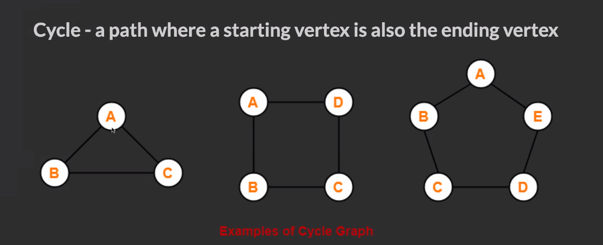
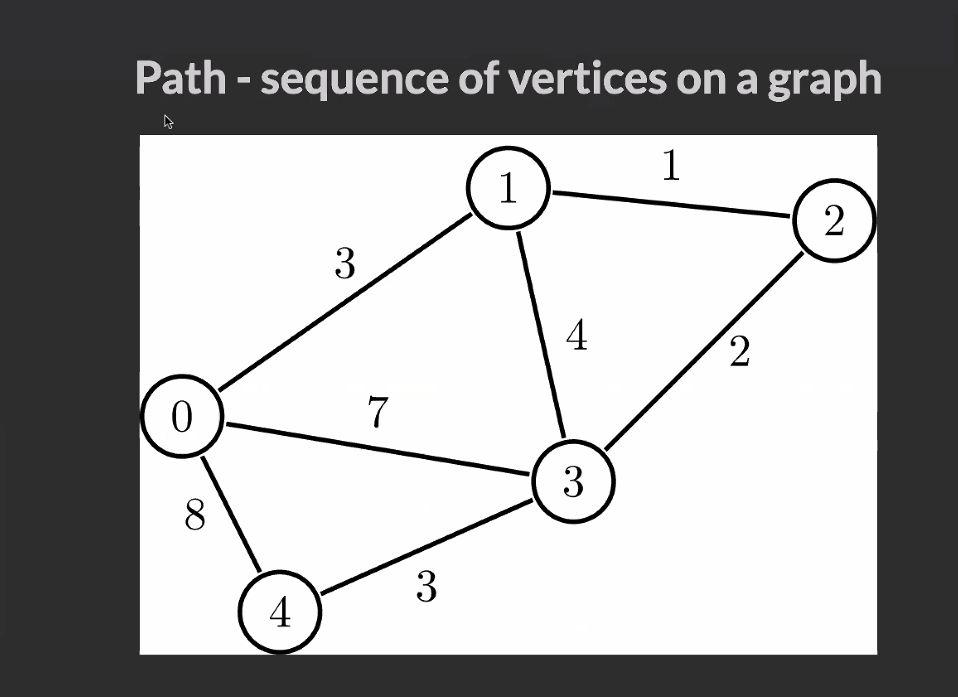
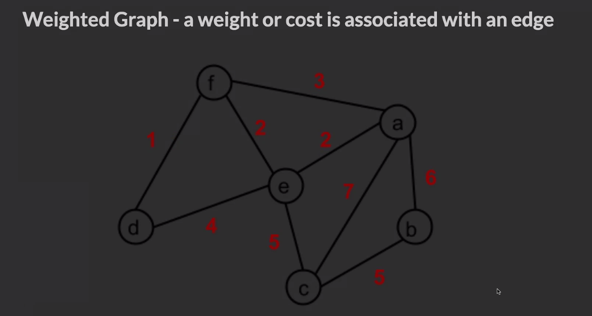
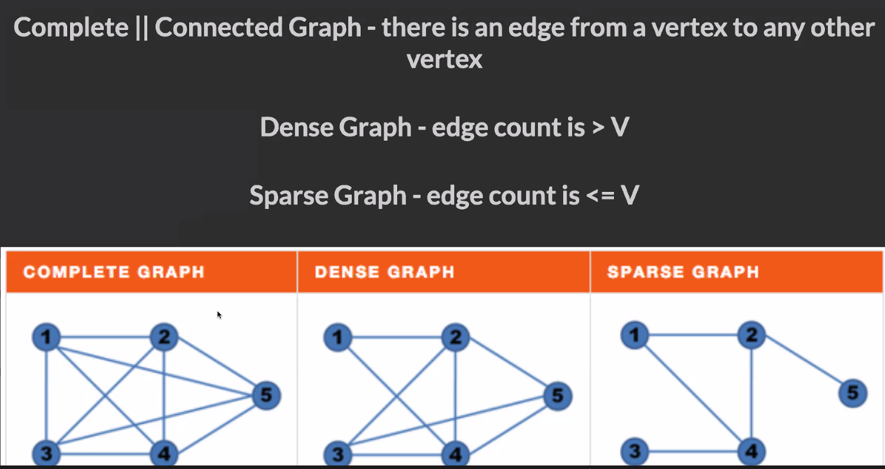
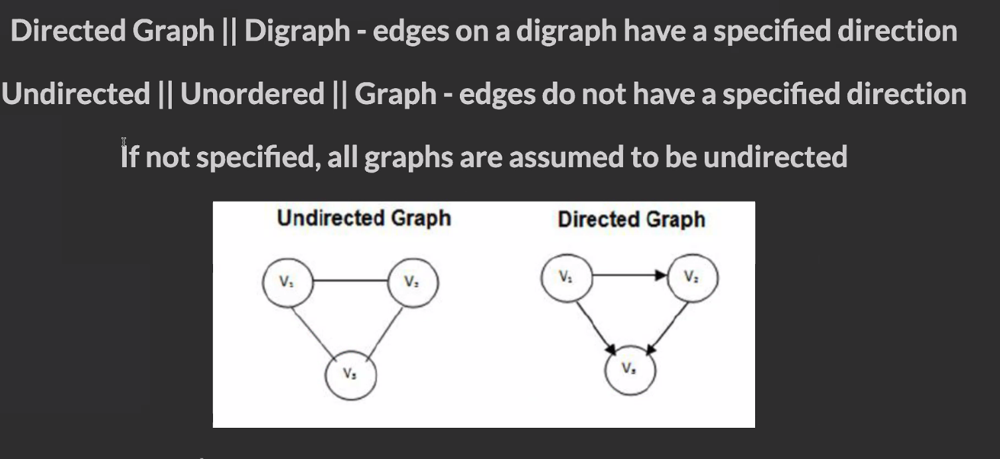

DFS-->   


---
---

BFS-->


```js
// class GraphNode {
//     constructor(val) {
//         this.val = val;
//         this.neighbors = [];
//     }
// }
//
// let a = new GraphNode("a");
// console.log('let a = new GraphNode("a"): ', a);
// let b = new GraphNode("b");
// let c = new GraphNode("c");
// console.log('let c = new GraphNode("c"): ', c);
// let d = new GraphNode("d");
// let e = new GraphNode("e");
// console.log('let e = new GraphNode("e"): ', e);
// let f = new GraphNode("f");
// console.log(
//     "------------------------------End of node instantions--------------------------------------"
// );
// console.log("a.neighbors = [e, c, b]: ", (a.neighbors = [e, c, b]));
//
// console.log("c.neighbors = [b, d]: ", (c.neighbors = [b, d]));
//
// console.log("e.neighbors = [a]: ", (e.neighbors = [a]));
//
// console.log("f.neighbors = [e]: ", (f.neighbors = [e]));
//
// console.log(
//     "------------------------------deapth first traversal (comment out adjacency list)--------------------------------------"
// );
//
// function depthFirstRecur(node, visited = new Set()) {
//     if (visited.has(node.val)) return;
//
//     console.log(node.val); //output
//     visited.add(node.val);
//
//     node.neighbors.forEach((neighbor) => {
//         depthFirstRecur(neighbor, visited);
//     });
// }
//
// //tree node class... if it didn't have a neighbours the value would be null but here it is just an empty array.
```
# <=================()===============>
```
// Implementing a Graph in Code
// Similar to when working with other ADTs, we can crate a node class
// This class can have a property which will store all the nodes
// which this instance should hold reference to.
```
```js
class GraphNode {
    constructor(val) {
        this.val = val;
        this.neighbors = [];
    }
}
let a = new GraphNode("a");
let b = new GraphNode("b");
let c = new GraphNode("c");
let d = new GraphNode("d");
let e = new GraphNode("e");
let f = new GraphNode("f");
a.neighbors = [b, c, e];
c.neighbors = [b, d];
e.neighbors = [a];
f.neighbors = [e];
```
// Adjacency Matrix
// The implementation above is considered rather clunky.
// We have no easy way to refer to the entire graph.
// Recall that there is no root to act as the definite starting point (unlike with Trees).
// How can we pass this graph to a function?
// One of the solutions is to create an Adjacency Matrix, a grid utilizing a 2D array.
// Matrix implementation allows us to refer to the entire graph by simply referring to the 2D array.
// The row index corresponds to the source of an edge.
// The column index will correspond to its destination.
// A value of true will mean that there does exist an edge from source to destination,
// ie, the source node should hold reference to destination node.
```js
  - One axis (outside array) has an entry (inner array) for each node in the graph. If one node is connected to another node in the graph, our entry in the inner array is set to true. Otherwise the entry is false.
let matrix = [
    /*  Destinations =>     A/0     B/1     C/2     D/3     E/4     F/5   */
    /*  ----------------------------------------------------------------- */
    /*             | A/0 */ [true, true, true, false, true, false],
    /*             | B/1 */ [false, true, false, false, false, false],
    /* Sources =>  | C/2 */ [false, true, true, true, false, false],
    /*             | D/3 */ [false, false, false, true, false, false],
    /*             | E/4 */ [true, false, false, false, true, false],
    /*             | F/5 */ [false, false, false, false, true, true],
];
```
// Disadvantage:
//  An adjacency matrix requires a lot of space.
//  To represent a graph of n nodes, we must allocate n^2 space for the 2D array.
//  If there are few edges in graph we will have to use n2 space,
// even though the array will only contain a few true elements.
// Adjacency List
// We use an object where keys represent the node labels.
// The values associated with the keys will be an array containing all
// adjacent nodes,
// ie, the nodes which this instance (represented by a key)
// should hold reference to.
// An adjacency list is easy to implement and allows us to refer to the
// entire graph by simply referencing the object.
// The space required for an adjacency list is the number of edges in
// the graph.
```js
let adjList = {
    a: ["b", "c", "e"],
    b: [],
    c: ["b", "d"],
    d: [],
    e: ["a"],
    f: ["e"],
};
```
// Recursive case given a node
function depthFirstNode(node, visited = new Set()) {
    // We utilize a Set for our memo instead of a regular object
    // A Set is like an object where the keys have no values
    if (visited.has(node.val)) return;
    console.log(node.val);
    visited.add(node.val);
    node.neighbors.forEach((neighbor) => depthFirstNode(neighbor, visited));
}
// We invoke this with an instance of the graph node class
// depthFirstNode(f);
// depthFirstNode(node, visited);   // 1st frame,   node.val = 'f', visited = {'f'}
// depthFirstNode(node, visited);   // 2nd frame,   node.val = 'e', visited = {'f', 'e'}
// depthFirstNode(node, visited);   // 3rd frame,   node.val = 'a', visited = {'f', 'e', 'a'}
// depthFirstNode(node, visited);   // 4th frame,   node.val = 'b', visited = {'f', 'e', 'a', 'b'}, popped off stack
// depthFirstNode(node, visited);   // 5th frame,   node.val = 'c', visited = {'f', 'e', 'a', 'b', 'c'}
// depthFirstNode(node, visited);   // 6th frame,   node.val = 'd', visited = {'f', 'e', 'a', 'b', 'c', 'd'}, popped off stack
// 5th frame,     node.val = 'c'     returns undefined,     popped off the stack
// 4th frame,     node.val = 'e'     vistied.has(node.val) = true,    returns undefined,     popped off the stack
// 3rd frame,     node.val = 'a'     returns undefined,     popped off the stack
// 2nd frame,     node.val = 'e'     returns undefined,     popped off the stack
// 1st frame,     node.val = 'f'     returns undefined,     popped off the stack
// Final return value: undefined
// Recursive case given an adjacency list
```js
// let adjList = {
//   'a': ['b', 'c', 'e'],
//   'b': [],
//   'c': ['b', 'd'],
//   'd': [],
//   'e': ['a'],
//   'f': ['e'],
// };
```
```js
function depthFirstAdj(graph, node, visited = new Set()) {
    // if this node has already been visited, then return early
    if (visited.has(node)) return;
    // otherwise it hasn't yet been visited,
    // so print it's val and mark it as visited.
    console.log(node);
    visited.add(node);
    // then explore each of its neighbors
    graph[node].forEach((neighbor) => {
        depthFirstAdj(graph, neighbor, visited);
    });
}
```
// // We invoke this with the adjacency list and a key from the list.
// depthFirstAdj(adjList, 'f');
// console.log(`\n----------\n`);
// depthFirstAdj(adjList, 'a');
// We see that when we invoke this function with 'a' we are not able to access the 'f' node
```js
function completeDepthFirst(graph) {
    let visited = new Set();
    for (let node in graph) {
        _depthFirstRecur(node, graph, visited);
    }
}
```
```js
function _depthFirstRecur(node, graph, visited) {
    // if this node has already been visited, then return early
    if (visited.has(node)) return;
    // otherwise it hasn't yet been visited,
    // so print it's val and mark it as visited.
    console.log(node);
    visited.add(node);
    // then explore each of its neighbors
    graph[node].forEach((neighbor) => {
        _depthFirstRecur(neighbor, graph, visited);
    });
}
// We invoke this with the adjacency list and a key from the list.
completeDepthFirst(adjList, "f");
console.log(`\n----------\n`);
completeDepthFirst(adjList, "a");
```


- Adjacency List - POJO
  - Object where every value in the graph has a key
  - Value for the key is an array with each other node that it is connected to (neighbors)
  - Easy to iterate through
  - Doesn't take up as much space as an Adjacency Matrix or Node
  - Can refer to the entire graph by referencing the object
  ```javascript
    let list = {
      a: ['b', 'c', 'e'],
      b: [],
      c: ['b', 'd'],
      d: [],
      e: ['a'],
      f: ['e']
    };
    ```
```js
 class GraphNode {
    constructor(val) {
      this.val = val;
      this.neighbors = [];
    }
  }
  ```
3. Given a graph in one of the above implementations, be able to traverse the graph in a breadth-first or depth-first manner.
- We can use recursion or iteration to traverse each node.
- We generally want to keep track of each node that we've visited already so that we don't get trapped in cycles. Easiest way to do this is to keep a Set variable that we update as we traverse to each node.


Graph
-----


*   **Quick summary**: a data structure that stores items in a connected, non-hierarchical network.
*   **Important facts**:
    *   Each graph element is called a _node_, or _vertex_.
    *   Graph nodes are connected by _edges_.
    *   Graphs can be _directed_ or _undirected_.
    *   Graphs can be _cyclic_ or _acyclic_. A cyclic graph contains a path from at least one node back to itself.
    *   Graphs can be _weighted_ or _unweighted_. In a weighted graph, each edge has a certain numerical weight.
    *   Graphs can be _traversed_. See important facts under _Tree_ for an overview of traversal algorithms.
    *   Data structures used to represent graphs:
        *   _Edge list_: a list of all graph edges represented by pairs of nodes that these edges connect.
        *   _Adjacency list_: a list or hash table where a key represents a node and its value represents the list of this node's neighbors.
        *   _Adjacency matrix_: a matrix of binary values indicating whether any two nodes are connected.
*   **Pros**:
    *   Ideal for representing entities interconnected with links.
*   **Cons**:
    *   Low performance makes scaling hard.
*   **Notable uses**:
    *   Social media networks.
    *   Recommendations in ecommerce websites.
    *   Mapping services.
*   **Time complexity** (worst case): varies depending on the choice of algorithm. `O(n*lg(n))` or slower for most graph algorithms.
