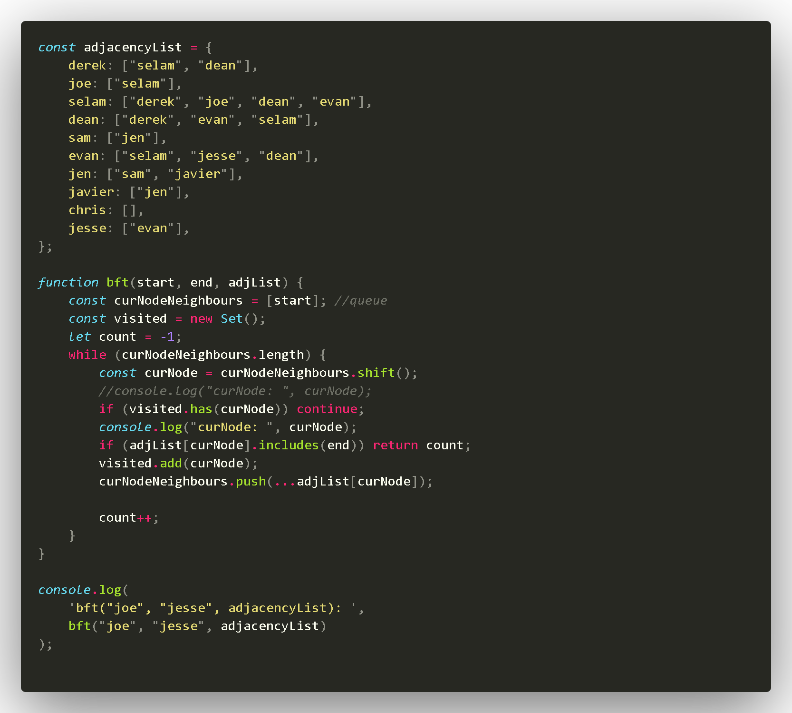

Pseudo Code:
Parameters : start node , end node
Initialize queue array (temp storage) (stores the neighbours of the current node)
And a set visited
Declare counting variable 
 While  the queue still contains nodes  
Loop execution{
Declare a current node variable 
If the current node is our end node return counter
Add the current node to the set 
For each element of the set  we push the current node to que(if it has not yet been visited)

An adjacency list is easy to implement and allows us to refer to the entire
graph by simply referencing the object. 

The space required for an adjacency list
is the number of edges in the graph. Since there will be at most n2
edges in a graph of n nodes, the adjacency list will use at most the same amount
